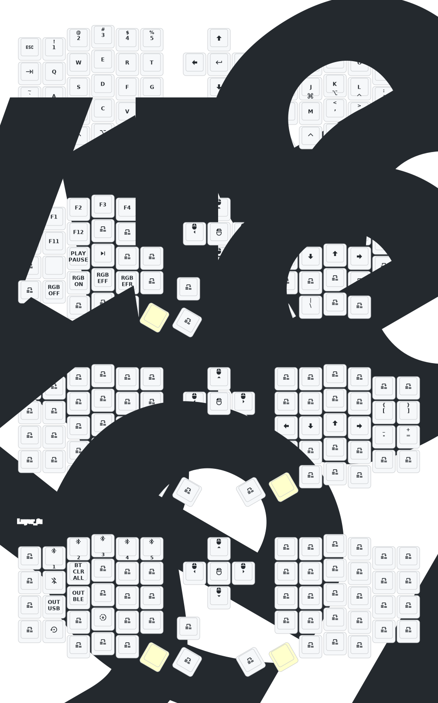

# Eyelash Sofle — ZMK Config

Personal [ZMK](https://zmk.dev) firmware config for the wireless "Eyelash" Sofle keyboard (nRF52840-based Sofle sold on AliExpress). Forked from [a741725193/zmk-sofle](https://github.com/a741725193/zmk-sofle).

## Keymap

- **Layer 0** — base QWERTY. Home row mods on the right hand only (`J`=GUI, `K`=Alt, `L`=Ctrl, `;`=Shift, balanced flavor). Encoder: volume.
- **Layer 1** (left thumb) — function keys, media, RGB controls, arrows. Encoder: scroll.
- **Layer 2** (right thumb) — brackets, minus/equal, arrows.
- **Layer 3** (Layer 1 + 2) — Bluetooth profile select/clear, USB/BLE output toggle, `&sys_reset`, `&bootloader`.

## Editing the keymap

Two options:

1. **[Keymap Editor](https://nickcoutsos.github.io/keymap-editor/)** (browser GUI) — sign in with GitHub, grant it access to this repo, and it edits `config/eyelash_sofle.keymap` directly. Committing from the editor triggers the build automatically.
2. **By hand** — edit [`config/eyelash_sofle.keymap`](config/eyelash_sofle.keymap) and push. See the [ZMK keymap docs](https://zmk.dev/docs/keymaps) and [key code list](https://zmk.dev/docs/keymaps/list-of-keycodes).

[ZMK Studio](https://zmk.dev/docs/features/studio) is also supported for live remapping — flash the `eyelash_sofle_studio_left` firmware to the left half and connect at [zmk.studio](https://zmk.studio).

The keymap diagram above is regenerated automatically on every push by [keymap-drawer](https://github.com/caksoylar/keymap-drawer) (`.github/workflows/draw.yml`).

## Building & flashing

Firmware builds in GitHub Actions on every push (`.github/workflows/build.yml`). To flash:

1. Download the artifact zip from the latest [Actions run](../../actions).
2. Put a half into bootloader mode: double-press its reset button, or use the `&bootloader` key on layer 3. It mounts as a USB drive named `NICENANO`.
3. Copy the matching `.uf2` file onto the drive (left firmware → left half, right → right half). It reboots itself when done.

If a half gets into a bad state, flash `settings_reset.uf2` to it, then re-flash the normal firmware and re-pair.

## Bluetooth

On layer 3: `BT_SEL 0–4` selects one of 5 profiles, `BT_CLR` clears the current profile, `OUT_USB`/`OUT_BLE` switches between wired and wireless output. Pairing between halves is automatic; if the halves stop talking to each other, use `settings_reset` on both.

## Hardware notes (from upstream)

- Deep sleep after 1 hour idle; RGB underglow auto-off when idle or on USB.
- For 3D-printed case files or hardware issues, contact the upstream maintainer: 380465425@qq.com

## Useful links

- [ZMK docs](https://zmk.dev/docs) · [keycodes](https://zmk.dev/docs/keymaps/list-of-keycodes) · [behaviors](https://zmk.dev/docs/keymaps/behaviors)
- [Keymap Editor](https://nickcoutsos.github.io/keymap-editor/) — GUI keymap editing
- [keymap-drawer](https://github.com/caksoylar/keymap-drawer) — keymap diagram generator
- [ZMK Studio](https://zmk.dev/docs/features/studio) — live remapping
- [Upstream repo](https://github.com/a741725193/zmk-sofle) — original config, updates, 3D models
